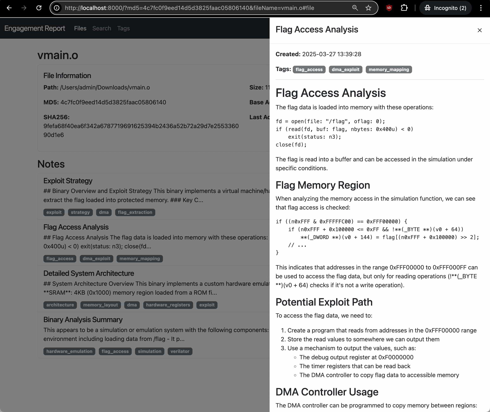

# pcm
PCM (MCP but reversed), **MCP for reverse engineering**.

## Features

- Analysis
  - IDA
    - repl (IDAPython)
    - disassembly
    - decompilation
    - set types
    - ...
- Memory
  - Engagement reports
    

<details>
<summary>Full list of features</summary>


```
- `get_function_by_name(name)`: Get a function by its name.
- `get_function_by_address(address)`: Get a function by its address.
- `get_current_address()`: Get the address currently selected by the user.
- `get_current_function()`: Get the function currently selected by the user.
- `list_functions()`: List all functions in the database.
- `decompile_function(address)`: Decompile a function at the given address using Hex-Rays.
- `disassemble_function(address)`: Get assembly code (address: instruction; comment) for a function.
- `get_entrypoints()`: Get all entrypoints in the binary.
- `get_function_blocks(address)`: Get all basic blocks in a function.
- `get_function_cfg(address)`: Get control flow graph for a function.
- `get_xrefs_to(address)`: Get all cross references to the given address.
- `get_xrefs_from(address)`: Get all cross references from the given address.
- `set_decompiler_comment(address, comment)`: Set a comment for a given address in the function pseudocode.
- `set_disassembly_comment(address, comment)`: Set a comment for a given address in the function disassembly.
- `rename_local_variable(function_address, old_name, new_name)`: Rename a local variable in a function.
- `rename_function(function_address, new_name)`: Rename a function.
- `set_function_prototype(function_address, prototype)`: Set a function's prototype.
- `set_local_variable_type(function_address, variable_name, new_type)`: Set a local variable's type.
- `create_structure_type(name, members, is_union)`: Create a new structure type.
- `get_metadata()`: Get metadata about the current IDB.
- `repl_idapython(content)`: Run IDAPython code and return the results with stdout/stderr captured.
- `add_note(title, content, address, tags)`: Add a new analysis note for the current binary.
- `update_note(note_id, title, content, tags)`: Update an existing note.
- `get_notes(file_md5, address, tag)`: Get analysis notes for a binary.
- `delete_note(note_id)`: Delete an analysis note.
```

</details>


## Installations

Prerequisites:
- [`uv`](https://github.com/astral-sh/uv)


1. Clone the repository
    ```
    git clone https://github.com/rand-tech/pcm
    ```
1. Add `pcm` to you mcp config
    example
    ```
    {
        "mcpServers": {
            "pcm": {
                "command": "uv",
                "args": [
                    "--directory",
                    "path_to/pcm",
                    "run",
                    "server.py"
                ]
            }
        }
    }
    ```
1. Use the MCP 


**Related projects**:

- <https://github.com/mrexodia/ida-pro-mcp> 
- <https://github.com/MxIris-Reverse-Engineering/ida-mcp-server>

**Attribution**:
This project is based on [IDA Pro MCP](https://github.com/mrexodia/ida-pro-mcp) by Duncan Ogilvie (@mrexodia). Thank you

**License**:
This project is licensed under the MIT License - see the LICENSE file for details. The original code is also licensed under the MIT License.
